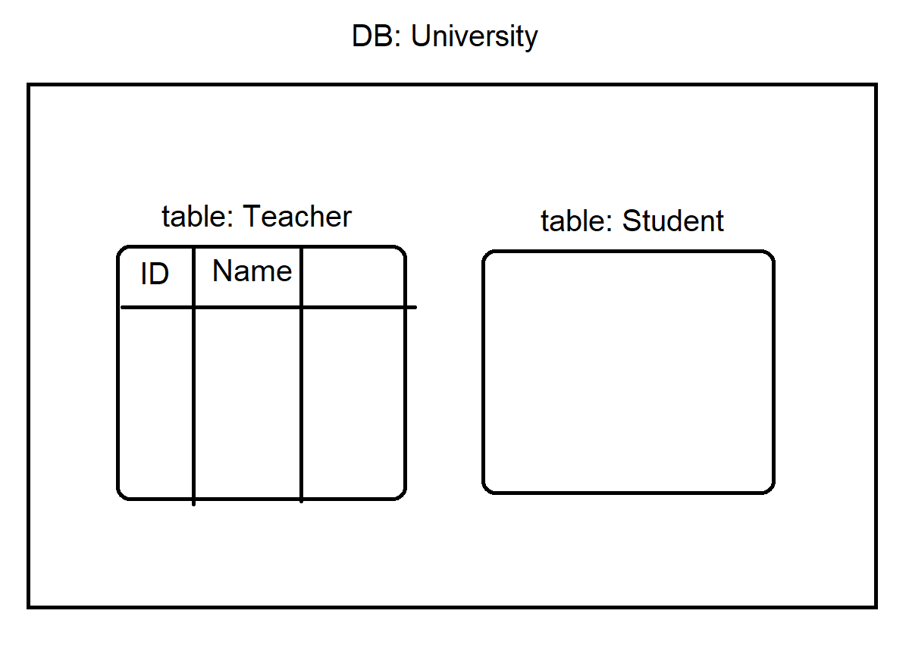

Link to the Lesson 01 recording in youtube: https://youtu.be/PMebNf_WRHg

# SQL - Structured query language. 
SQL היא שפה לעבודה עם טבלאות נתונים
#### DB - database. מסד נתונים
---
## CRUD - 4 main commands of SQL:

1. **C** - create
```sql
CREATE DATABASE `db_name`
CREATE TABLE `table_name`
```
2. **R** - read 
```sql
SELECT * FROM `db_table`
```
3. **U** - update
4. **D** - Delete


---
## First SQL database and table:


```sql
CREATE DATABASE University;

USE University;

CREATE TABLE Teacher(
	ID INT, 
    FullName NVARCHAR(20)
);

SELECT * FROM Teacher;

```
